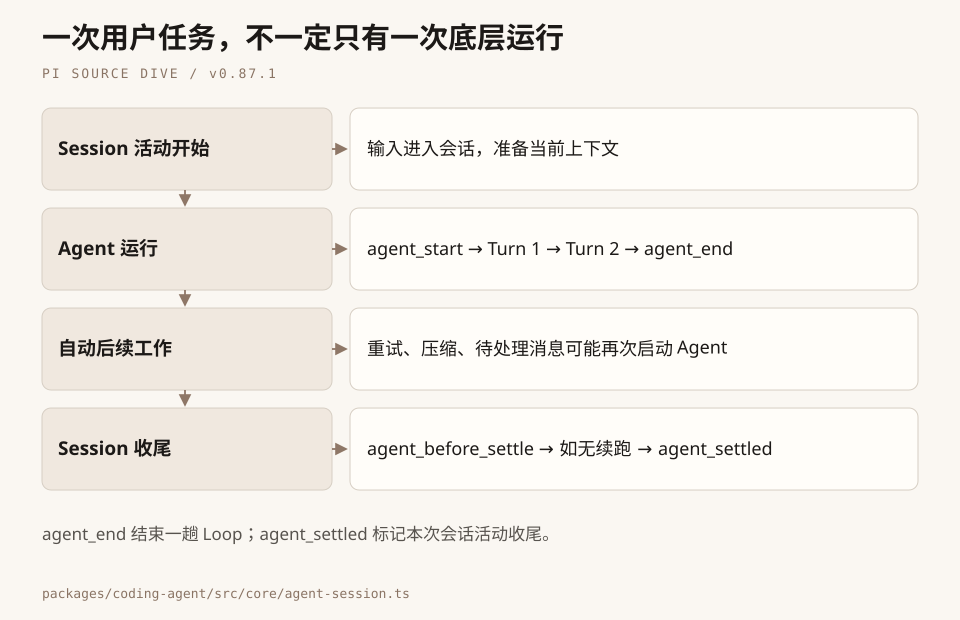
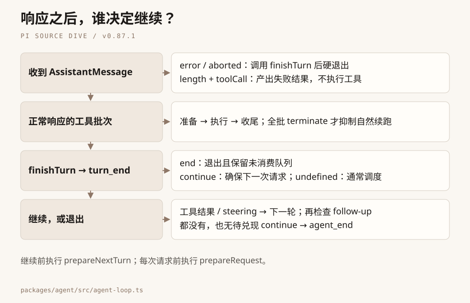
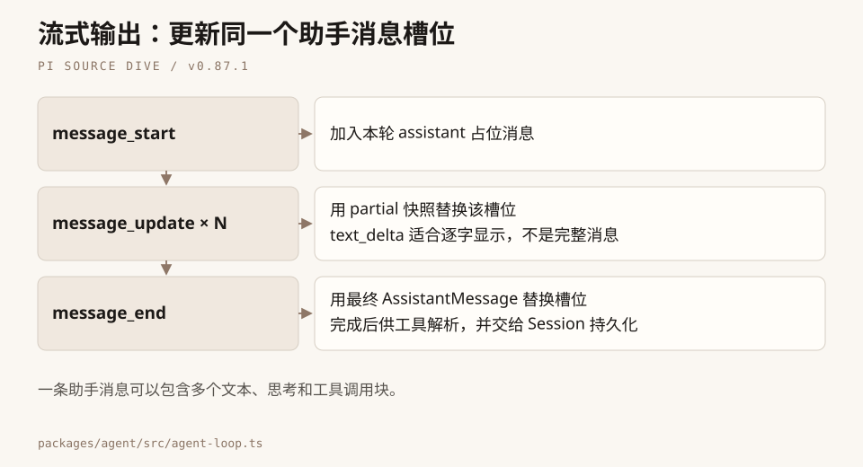
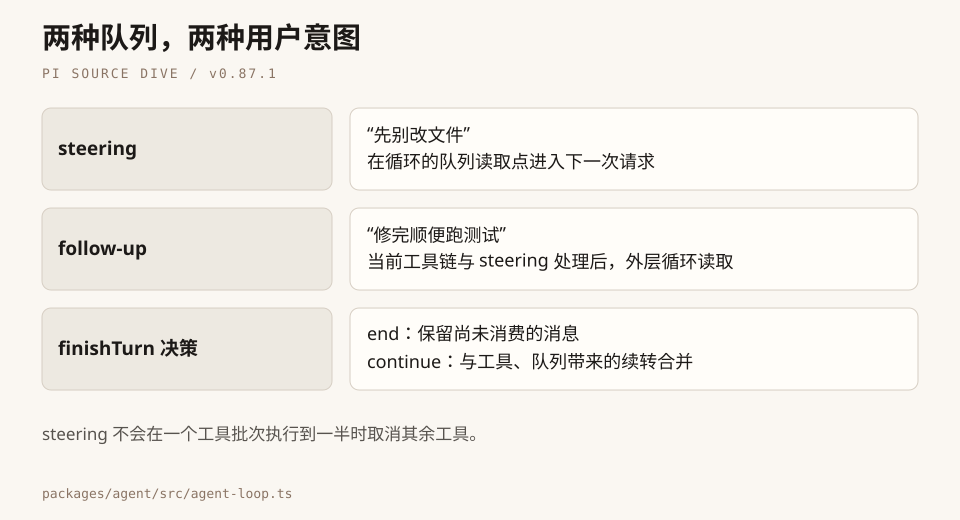
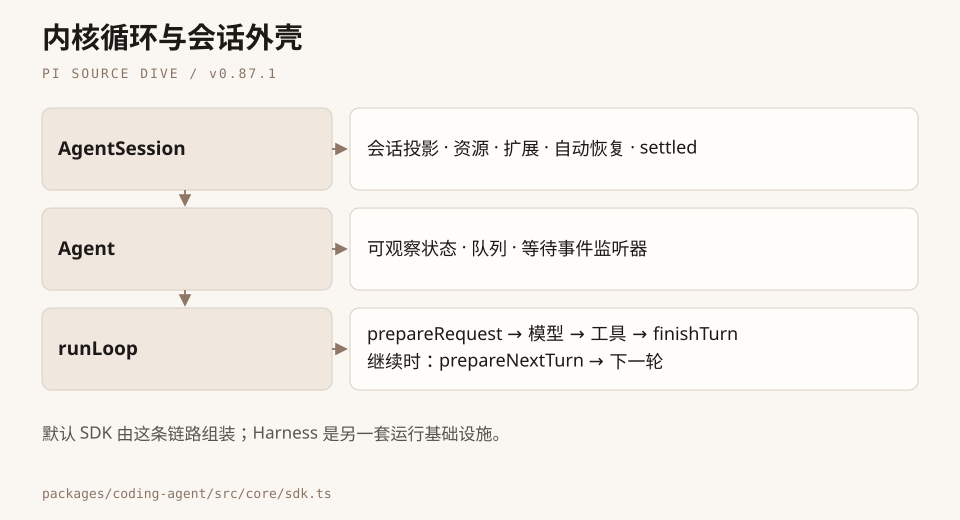

# 第3章：Agent Loop —— 让模型转动起来的引擎

> 前一章我们看了 Pi 的分层架构。架构只是"骨架"——Agent 真正的生命力来自"循环"。这一章，我们从最基础的问题出发：**为什么需要循环？循环怎么转？什么时候停？** 然后追踪一条用户消息的完整旅程，看清 Agent Loop 的每一次心跳。

---

## 一、引子：大模型的三种用法

在聊 Agent Loop 之前，我们先退一步，看看"使用大模型"这件事本身有几种模式。这对理解"为什么需要循环"至关重要。

### 模式 1：直接调用 —— "模型，回答我"

最原始、最直觉的用法。你构建好提示词，调用一次 API，拿到结果，完事。

```
用户输入 → 构建提示词 → 调模型 → 模型输出 → 展示结果
```

下面是通用教学伪代码，`llm.chat` 不是 Pi API：

```typescript
// 教学简化：省略外围定义，展示数据形状或关键步骤
const response = await llm.chat({
  messages: [
    { role: "system", content: "你是一个翻译助手" },
    { role: "user", content: "把这段代码翻译成 Python" },
  ],
});
console.log(response.content);
```

**核心工作在于"构建提示词"**。提示词写得好，结果就好。一次调用，一次输出，没有来回。

适用场景：翻译、摘要、问答、代码补全——凡是"一问一答"能搞定的事。

### 模式 2：Workflow —— "模型，你先做第一步，我检查一下，再做第二步"

当任务变复杂，你发现一次性很难得到满意结果。于是你把大任务拆成多步，每步调一次模型，步骤之间由**你的代码**控制流转。

```
用户输入 → [步骤1: 调模型分析] → [你的代码: 提取关键信息]
         → [步骤2: 调模型生成草稿] → [你的代码: 检查质量]
         → [步骤3: 调模型润色] → 最终输出
```

每一步模型只负责自己的那份工作，**决策权在你手上**——你知道什么时候该进入下一步，模型只是流水线上的一环。

适用场景：文档生成流水线、代码审查自动化、RAG（检索增强生成）。

### 模式 3：Agent Loop —— "模型，你自己决定怎么做"

到了 Agent 模式，你把决策权交给了模型。

```
用户输入 → 调模型 → 模型说"我需要读文件" → 执行读文件 → 模型看结果
         → 模型说"还需要搜索代码" → 执行搜索 → 模型看结果
         → 模型说"我知道了，答案是..." → 输出 → 结束
```

关键区别：**步骤之间的流转不再由你写死，而是由模型的输出内容来驱动。** 你的代码只做两件事：
1. 把用户的输入和工具执行结果喂给模型
2. 如果模型输出的内容里包含了工具调用请求，就执行它；如果没有，就认为任务完成了

上面说的是最简循环，生产实现还会处理队列、钩子、错误与取消。

至于"该调什么工具"、"该调几次"——这些由模型的输出内容决定。"什么时候该停"——这是**人类定义的规则**：当模型的一次输出中不再包含工具调用时，我们就认为循环可以结束了。

用一个对比表格，三种模式的区别一目了然：

| 维度 | 直接调用 | Workflow | Agent Loop |
|------|---------|----------|------------|
| 决策者 | 用户 | 你的代码 | 模型 |
| 模型调用次数 | 1 次 | N 次（由代码控制） | 不确定（由模型控制） |
| 核心工作 | 写提示词 | 设计流程 | 定义工具和循环 |
| 模型角色 | 执行者 | 流水线环节 | 自主决策者 |
| 典型场景 | 翻译、摘要 | 文档流水线、RAG | 编程助手、自动化任务 |

---

## 二、先搞清楚几个概念：一次运行、Turn 与真正结束

你让 Agent “读文件、改代码、跑测试”，它可能调好几次模型。读源码前，先把两个时间尺度分开。

**一个 Turn，是一次模型响应，以及这次响应要求执行的那一批工具。** 如果模型一口气要求 read、grep、find，三个工具都属于这一轮；把结果送回模型，才进入下一轮。一个 Turn 不是一次工具调用，也不是用户的一句话。

**一次底层运行，由 `agent_start` 和 `agent_end` 包住，可以包含多个 Turn。** 为了方便画图，本章把这段叫作 Trace；它是阅读用语，不是一个需要你创建的 SDK 对象，也不要和遥测系统的 trace ID 混为一谈。

```
AgentSession 处理一次输入
│
├── 一次底层运行：agent_start
│   ├── Turn 1：调模型 → 要读文件 → 执行 read → turn_end
│   └── Turn 2：带着文件再调模型 → 给出说明 → turn_end
│   agent_end
│
├── 会话层检查：重试？压缩恢复？待处理输入？扩展要求继续？
│   └── 必要时再次启动底层运行
│
└── agent_settled：这次会话活动处理完了
```

这最后一层很重要。`agent_end` 只保证**这一趟底层循环结束**，不保证 coding-agent 已经把所有善后工作做完。接 Web 服务时，如果在第一个 `agent_end` 就关闭输出通道，后续重试的结果可能还没发出来。第 7 章会专门拆 `agent_settled`。



首轮 `turn_start` 在 `runAgentLoop()` 入口发出；后续轮次则在 `runLoop()` 完成下一轮准备后发出。这个顺序解释了为什么你在事件日志里不会看到首轮重复开始。

---

## 三、全景：一条消息的旅程，以及循环怎么转

还是那句“帮我读一下 src/main.ts”。你的输入变成 **Message**，Loop 调用 **Model**，模型要求的操作交给 **Tool**，每一步通过 **Event** 通知外面。循环负责把这四者串起来。

### 先看一趟没有异常的旅程

```
prompt("帮我读一下 src/main.ts")
  → agent_start / turn_start
  → 用户消息进入上下文，并发出 message_start / message_end
  → prepareRequest：最后核对这次请求使用的上下文
  → transformContext → convertToLlm → normalizeContext
  → 调模型：得到 read 工具调用
  → 执行 read，追加 ToolResultMessage
  → finishTurn → turn_end
  → 决定继续，prepareNextTurn → turn_start
  → prepareRequest → 再调模型：得到文件说明
  → finishTurn → turn_end
  → 没有待执行工具、排队消息或显式继续请求
  → agent_end
```

这张图先省略了取消、截断和恢复，但保留了新版最容易读错的顺序：**先完成这一轮，再决定要不要下一轮；确定要继续，才准备下一轮。**

### stopReason 是信号灯，但不是唯一开关

`stopReason` 是 Pi 统一后的响应结束原因。适配器把供应商的字段映射到它，也把网络错误或取消编码进去。

| 值 | Loop 怎样处理 |
|----|----|
| `error` / `aborted` | 调用 `finishTurn` 做收尾，发 `turn_end`、`agent_end` 后硬退出；不执行工具，不消费后续队列 |
| `length` | 输出达到上限；若包含工具调用，将这批调用转成错误结果，不执行残缺参数 |
| `stop` / `toolUse` | 继续检查 `content` 中实际存在的 `toolCall` 块，而不是仅凭结束原因猜测 |

类型中另有 `pending`（尚未完成）和 `deferred`（延后处理）状态；上表聚焦本书这条同步完成路径。不要把表格当成 StopReason 的全部联合成员。

为什么截断时要这么谨慎？想象模型正在生成 `write` 的参数，文件内容只输出了一半。如果照着已解析出的 JSON 就执行，文件可能被写坏。`failToolCallsFromTruncatedMessage()` 会为这些调用产生错误结果，让后续响应知道发生了什么。

还有三类信号能影响下一轮：工具结果、消息队列，以及 `finishTurn` 的决定。因此“没有工具调用就停”只适合解释最简 Loop，不能当作生产实现的完整规则。



---

## 四、源码详解：基础 Loop 与 coding-agent 的叠加设计

### 4.1 最简内核：先别被钩子吓住

把 UI、队列和恢复都拿开，一个教学版循环仍然很短：

```typescript
// 教学伪代码：帮助理解闭环，不是可直接运行的 Pi API
while (true) {
  const reply = await callModel(history);
  history.push(reply);
  if (isErrorOrAborted(reply)) break;
  const calls = getToolCalls(reply);
  if (calls.length === 0) break;
  for (const call of calls) {
    history.push(await executeTool(call));
  }
}
```

**模型决定要做什么，宿主决定允许怎么做，以及何时继续。** 后面的复杂度都围绕真实需求生长：用户中途改主意、工具失败、窗口快满了，或者扩展希望再检查一次结果。

这些机制有一部分直接由 agent-core 提供；coding-agent 则给钩子接上资源、会话和扩展。不能把 steering、follow-up 都说成只存在于产品层。

### 4.2 入口：两份消息列表，各有用处

`Agent.prompt()` 最终进入 `runAgentLoop()`。这个函数接收输入消息、上下文、循环配置、事件接收器、取消信号和 `streamFn`。

入口创建两份列表：

```
currentContext.messages = 之前的消息 + 本次输入
newMessages             = 本次运行新增的消息
```

前者供模型理解整段对话，后者用于报告这一趟产生了什么。`declareToolChanges()` 还会比较可执行工具与 transcript 中的工具声明，把变化写成 system 消息。

这里的数组副本不是“与 Agent 状态绝缘”的意思。`Agent` 通过收到的事件同步自己的状态，`AgentSession` 再把完成的消息写入会话。**循环中的工作副本、对外可观察状态和持久化记录，是三个相连的层次。** 第 10 章会把最后一层接上。

### 4.3 双层循环：内层做当前任务，外层接后续任务

先看源码的骨架，暂时省略流式响应和工具执行的展开：

```typescript
// 教学简化：保留 runLoop 的调度关系，省略参数和配置合并
while (true) {
  let hasMoreToolCalls = true;
  while (hasMoreToolCalls || pendingMessages.length > 0) {
    if (lastCompletedTurn) {
      await prepareNextTurn(lastCompletedTurn);
      // 准备耗时较长，且上次没选出 steering 时，再检查一次
      emitTurnStart();
    }
    appendPreparedAndQueuedMessages();
    await prepareRequest();
    const message = await streamAssistantResponse();
    // 错误/取消走硬退出；正常响应处理工具，再调用 finishTurn
    const decision = await finishTurn();
    emitTurnEnd();
    if (decision?.action === "end") return endRun();
    // 更新工具续转状态，选择 steering，记录显式 continue
  }
  // 优先接 follow-up；否则兑现尚未满足的一次显式继续
  if (hasFollowUp() || hasUnsatisfiedContinuation()) continue;
  break;
}
```

为什么要两层？假设正在修一个 bug，你又输入“修完顺便跑测试”。这句话可以等眼前的工具链跑完，再开启后续工作；但“先别改文件”应该在下一次合适的请求边界被读到。两种队列把两种意图区分开了。

### 4.4 三个钩子：请求前、轮末、下一轮前

| 钩子 | 何时运行 | 解决的问题 |
|----|----|----|
| `prepareRequest` | 每次请求之前，包括第一轮；已选中的输入消息已经发出事件 | 重新安装权威上下文、更新模型或思考级别 |
| `finishTurn` | assistant 和工具结果完成后、`turn_end` 之前 | 对完成的一轮做收尾，返回继续或结束决定 |
| `prepareNextTurn` | 已确认要开始下一轮时；首轮不运行 | 压缩、更新下一轮快照或模型 |

`finishTurn` 的决定在 `turn_end` **之后**生效。事件观察者仍能看到完整的一轮，宿主也有机会在停止前完成结构化记录。

返回值只有三种需要记住的情形：

- `undefined`：按通常的工具和队列规则走。
- `{ action: "end" }`：正常响应后结束这一趟，保留尚未消费的 steering/follow-up，不调用下一轮准备。
- `{ action: "continue" }`：确保再有一次请求；现有工具或队列触发的下一次请求已经算数，不额外多跑一轮。

错误和取消也会调用 `finishTurn`，但仍然硬退出，它返回的 continue 不能把这两种情况“救活”。这就是新版替换 `shouldStopAfterTurn` 时需要理解的语义，不能只把函数改个名字。

下面是一个完整的底层示例：最多完成三轮正常响应。它需要对应模型的认证；不包含 coding-agent 的自动压缩和会话存储。

```typescript
// 完整示例；依赖版本见本书修订记录
import { Agent } from '@earendil-works/pi-agent-core';
import { getModel, streamSimple } from '@earendil-works/pi-ai/compat';

let completed = 0;
const agent = new Agent({
  streamFn: streamSimple,
  initialState: {
    model: getModel('anthropic', 'claude-sonnet-4-5'),
    systemPrompt: 'Answer briefly.',
    tools: [],
  },
  finishTurn: async ({ message }) => {
    if (message.stopReason === 'error' || message.stopReason === 'aborted') return;
    completed += 1;
    if (completed >= 3) return { action: 'end' };
  },
});
await agent.prompt('Explain an agent loop.');
```

这个例子没有工具，多数情况下第一轮就自然结束。“最多三轮”并不等于“必须三轮”——不返回 continue，就不会为凑次数而多问模型。

### 4.5 调模型之前：两次转换，一次标准化

进入 `streamAssistantResponse()`，你会看到熟悉的两道门：

```typescript
// 源码节选：agent-loop.ts，streamAssistantResponse
let messages = context.messages;
if (config.transformContext) {
  messages = await config.transformContext(messages, signal);
}
const llmMessages = await config.convertToLlm(messages);
const llmContext = normalizeContext({ messages: llmMessages });
```

第一步仍在 Agent 的消息世界里做调整；第二步把自定义消息翻译成标准消息；第三步确认交给 Provider 的是 `TranscriptContext`。

新版的系统提示词和工具声明也在 transcript 的 system 消息里。这里不会再把独立的 `context.systemPrompt`、`context.tools` 原样塞给 Provider。外部便捷接口仍接受这些字段，但会先归一化；第 6 章再展开“为什么要把变化记进历史”。

临发请求还要取一次认证信息。OAuth 凭据可能已经刷新，把启动时的 token 永远缓存下来会在长会话中失效。Agent 只依赖 `streamFn` 契约，具体如何选择 Provider 和处理认证，留给第 4 章。

### 4.6 流式响应：一条消息在长大

模型不会等几百字都生成完才回答。Pi 把响应拆成 start、增量、终止事件：

```
start       → context.messages 追加一个 assistant 空壳
text_delta  → 更新最后那条消息，同时发 message_update
toolcall_*  → 同一条 assistant 消息逐渐有了工具调用
done/error  → 用最终消息收尾，发 message_end
```

关键不是“每个 token 都存一条消息”，而是**同一个消息位置的内容不断变完整**。这样 UI 可以实时展示，历史里又不会挤满碎片。若请求在 start 之前就失败，流可以直接给出 error；循环也要补齐这条失败消息的生命周期。



这还解释了订阅事件时为什么不能随手保存一个可变引用，过几秒再写数据库：你以为保存的是“当时”，看到的却可能已经是“后来”。跨异步边界需要自己复制必要字段。

### 4.7 执行工具：先整批定规则，再把结果放回去

对未被截断的正常响应，Loop 提取实际的 `toolCall` 块，决定整批串行还是并行：全局选择 sequential，或者任一工具声明 sequential，都会让整批串行。

并行也不是一声令下所有环节一起跑。参数准备、校验与前置钩子依次进行；允许执行的工具再并发；结束事件按完成时间发出，最终结果消息按原调用顺序排列。拦住 B 并不自动拦住 C，每个调用有自己的结果。

工具可以返回 `terminate: true`，但**必须整批最终结果都为 true**，才取消工具本身要求的续转。它不清空消息队列，也不能替代 `finishTurn: { action: "end" }` 的强制结束决定。后者直接结束运行，前者仍可能被 steering、follow-up 或显式 continue 接着推动。

第 5 章会打开每个工具内部的五步管道。这里先记住闭环：assistant 要求动作，工具产出 `ToolResultMessage`，下一次请求才能看到动作的后果。

### 4.8 steering 与 follow-up：递纸条，还是等散会

| 维度 | steering | follow-up |
|----|----|----|
| 读取时机 | 开始运行时、正常轮末；下一轮准备后有条件补查 | 内层循环原本将停下时 |
| 含义 | “后面按这个新指令做” | “当前任务结束后，再做这一件” |
| 不会做的事 | 不会自动取消正在执行的那批工具 | 不会抢在当前工具链前面 |

steering 像开会时有人递来纸条，follow-up 像散会后再看待办。真正取消需要 `abort()`，不要把排队消息当作中断信号。

队列还有 `all` 和 `one-at-a-time` 两种取法。源码在耗时的下一轮准备之后补查 steering，但只在此前没有选出消息时补查，避免 one-at-a-time 模式一轮吞掉两条。



### 4.9 从底层结束到会话结束

底层发出 `agent_end` 后，`AgentSession` 还会检查恢复工作与扩展边界。比如模型报上下文溢出，会话可能先压缩，再启动一次底层运行；`agent_before_settle` 扩展也可能追加条目并申请一次继续。

只有这些工作结束，才到 `agent_settled`。因此接入业务时要先想好自己关心哪个层次：统计一趟循环，用 agent_end；把本次会话活动的输出交给用户，用 agent_settled。错误仍要读取相应消息和事件，不能因为收到了 settled 就当作成功。

---

## 五、总结：Loop 的四条核心设计

**第一，循环让模型看见行动的结果。** 没有工具结果回到下一次请求，模型只有意图，没有反馈。

**第二，停止是多种信号共同决定的。** stopReason 区分硬退出和截断，工具结果决定是否自然续转，队列与 finishTurn 决定还有没有下一件事。

**第三，把扩展点放在有意义的边界。** 请求前安装上下文，轮末做决定，确定继续后再准备下一轮。不同职责分开，时序才能解释清楚。

**第四，底层循环与产品善后分开。** Agent 管执行，AgentSession 管会话、恢复与扩展。两者各自的“结束”不能混用。



---

## 六、下一站

Loop 跑起来了——我们知道它怎么调用模型、怎么执行工具。但它手里的 `streamFn` 到底怎样对接不同供应商？统一消息又怎样变成各家 API 的请求？

下一章，我们拆开模型调用层：《第4章：模型调用 —— 一行代码驾驭多个模型》。


---

> **本章关键源码索引**（Pi v0.87.1，固定发布提交）：
> - [packages/agent/src/agent-loop.ts#L101](https://github.com/earendil-works/pi/blob/f07218c4d4bbc12bef056a7058c3dd49dfe41abe/packages/agent/src/agent-loop.ts#L101) — runAgentLoop / runLoop
> - [packages/agent/src/types.ts#L151](https://github.com/earendil-works/pi/blob/f07218c4d4bbc12bef056a7058c3dd49dfe41abe/packages/agent/src/types.ts#L151) — FinishTurn 与请求准备契约
> - [packages/agent/src/agent.ts#L187](https://github.com/earendil-works/pi/blob/f07218c4d4bbc12bef056a7058c3dd49dfe41abe/packages/agent/src/agent.ts#L187) — Agent 状态、队列与事件等待
> - [packages/coding-agent/src/core/agent-session.ts](https://github.com/earendil-works/pi/blob/f07218c4d4bbc12bef056a7058c3dd49dfe41abe/packages/coding-agent/src/core/agent-session.ts) — Session 自动后续工作与收尾
