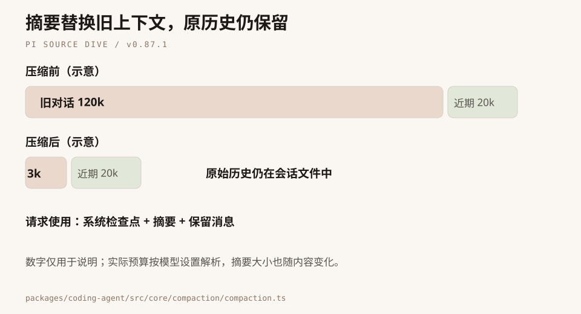
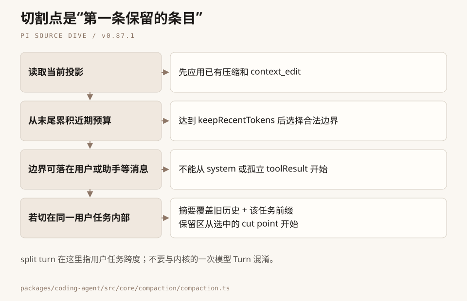
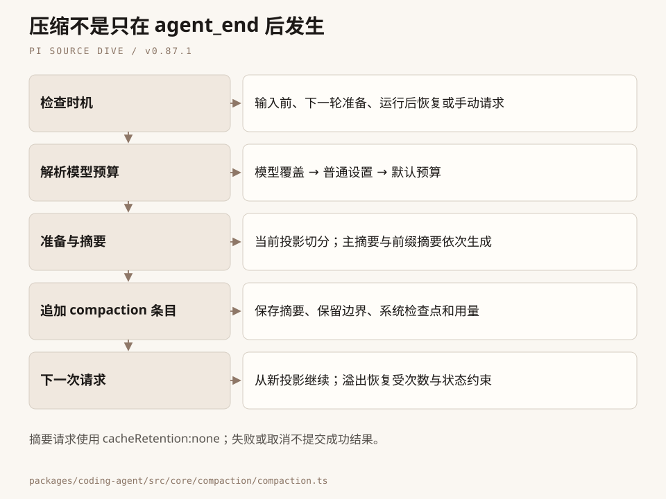

# 第9章：上下文压缩 —— 当对话太长怎么办

第 8 章我们看了上下文工程的全景——其中 `transformContext` 只是扩展点，真正"动手压缩"的核心机制是 Compaction。当对话越来越长，消息越来越多，最终会超出模型的上下文窗口（上限由所选模型的 contextWindow 决定）。这时候需要一件更激进的事——**压缩对话历史**。

这一章就看 Pi 怎么在上下文窗口快满时，把 50 轮对话压缩成一段摘要，让 Agent 继续"记住"之前发生了什么。

---

## 一、问题：对话越来越长，窗口装不下了

Agent 和 LLM 的对话是"有状态的"——每轮都把之前的完整历史发给模型。你和 Agent 聊了 50 轮，每轮可能有几千 token 的工具结果。算一算：50 轮 × 平均 3000 token/轮 = 150,000 token。假设当前模型窗口是 200,000 token，就已经接近上限。这里的数字只用于说明量级。



**配图说明**：数字仅用于说明；实际预算按模型设置解析，摘要大小也随内容变化。

满了会怎样？API 会报错："prompt is too long"。对话被迫中断。

最直觉的解决方案是删旧消息——把前 30 轮扔掉，只保留最近 20 轮。但这样 Agent 就"失忆"了——它不记得你最初让它做什么、不记得之前做了什么决策、不记得改了哪些文件。

Pi 的解法是**压缩（Compaction）**：把旧消息变成一段结构化摘要，用摘要替代原始消息。这样既腾出了空间，又保留了关键信息。

```
压缩前（185,000 token）：
┌── 第1-30轮（135,000 token）──┬── 第31-50轮（50,000 token）──┐
│  原始消息（大量工具结果）      │  原始消息（最近的上下文）      │
└──────────────────────────┴──────────────────────────┘

压缩后（约 60,000 token）：
┌── 摘要（约 10,000 token）──┬── 第31-50轮（50,000 token）──┐
│  结构化总结（目标、进度、     │  原始消息（完整保留）          │
│  决策、文件跟踪……）          │                              │
└────────────────────────┴──────────────────────────┘
```

Agent 仍然"记得"前 30 轮做了什么——只是记忆从"原始录像"变成了"摘要笔记"。

### 一个关键时序：压缩守在下一次请求的入口

先把时间尺度分开。第 3 章的 Turn 是一次模型响应加本批工具；一次用户输入可能产生许多 Turn。**压缩可以发生在同一次用户任务的两次模型请求之间**，不用等用户再说一句话。

```text
用户输入前的历史检查
    ↓
模型响应 → 执行工具 → turn_end
    ↓ 需要继续
prepareNextTurn → 检查当前投影预算 → 必要时压缩
    ↓
prepareRequest → 重建上下文 → 下一次模型请求

底层 agent_end 后
    ├─ 可重试错误 → 省略失败尝试的上下文贡献 → 重试
    ├─ 上下文溢出 / 可恢复截断 → 压缩后恢复
    └─ 无续跑工作 → agent_before_settle → agent_settled
```

手动 `/compact` 或 `session.compact()` 是另一条入口。无论从哪里进，压缩结果都要落成会话条目，再由当前投影生效；不是悄悄删掉一截 messages 数组。这是后面所有细节共同的主线。

---

## 二、什么时候压缩：红灯亮起

### 触发条件

压缩不是随便触发的，它有一个明确的"红线"：

```typescript
// 教学简化：省略外围定义，展示数据形状或关键步骤
function shouldCompact(contextTokens, contextWindow, settings): boolean {
    if (!settings.enabled) return false;
    return contextTokens > contextWindow - settings.reserveTokens;
}
```

代入具体数字：`contextWindow = 200,000`，`reserveTokens = 16,384`。

当 `contextTokens > 200,000 - 16,384 = 183,616` 时，触发压缩。

`reserveTokens` 是为 LLM 回复预留的空间——你不能把上下文窗口塞满到 200,000，否则模型连回复的空间都没有了。

### 预算是按模型解析的

默认 `reserveTokens = 16384`、`keepRecentTokens = 20000` 仍在，但它们不是每个模型都必须使用的常数。SettingsManager 对每个字段分别按“provider/model 覆盖 → 普通设置 → 默认值”解析，要求非负安全整数。

```json
{
  "compaction": {
    "enabled": true,
    "reserveTokens": 16384,
    "keepRecentTokens": 20000,
    "modelOverrides": {
      "anthropic/claude-sonnet-4-6": {
        "reserveTokens": 24000,
        "keepRecentTokens": 16000
      }
    }
  }
}
```

这只是配置示例，不是该模型的推荐预算。窗口大小取当前模型的 `contextWindow`。reserve 为回复及请求余量留空间；keepRecent 决定切割时希望保留的近期内容，两者不能混为一谈。

### Token 估算：优先看账单，再估新增部分

Pi 不是对整个历史永远只做 chars/4。`estimateContextTokens` 优先找到最后一条有有效 usage 的助手消息，用 Provider 回报的 token 量作为基数，再估算它后面新增的工具结果和消息。错误、取消或全零 usage 不能当成可靠基数。

```text
有可用 usage：已报告的上下文 token + 之后新增消息的估算
没有可用 usage：按各类消息内容做启发式估算
发生后续 context_edit / compaction：旧 usage 可能对应旧视图，重新估算当前投影
```

文本估算仍使用字符数启发式，工具参数、图片等也有自己的处理。它不是 tokenizer，对中文、代码、图片的偏差不同，不能称为“保证高估”的算法。预留空间、Provider usage 和溢出恢复共同兜底。

### 两种触发场景

| 场景 | 什么时候触发 | 意味着什么 |
|------|------------|-----------|
| **预防性压缩** | token 超过阈值（183,616）但还没报错 | 提前压缩，避免 API 报错 |
| **应急性压缩** | API 返回上下文溢出错误 | 补救措施，先压缩再重试 |

预防性压缩是常态——在问题发生之前就处理掉。应急性压缩是兜底——万一估算偏了，API 真报错了，还有一道防线。

---

## 三、在哪切：切割点算法

知道该压缩了，但从哪里"下刀"？不能随便切——有些位置切了会破坏数据完整性。



**配图说明**：split turn 在这里指用户任务跨度；不要与内核的一次模型 Turn 混淆。

### 不是哪里都能切

LLM 的对话历史有严格的结构约束。比如 `ToolResult` 消息必须紧跟在触发它的 `AssistantMessage`（含 ToolCall）之后。如果你把 ToolCall 留在"保留区"、把 ToolResult 切到"压缩区"，模型会看到"我调用了 read 工具，但结果在哪？"——上下文断裂。

所以切割点必须是**有效切割点**——不会破坏消息对的位置。

```
entry:  0     1     2      3       4     5      6       7      8
       ┌─────┬─────┬──────┬───────┬─────┬──────┬───────┬──────┬─────┐
       │ hdr │ usr │ ass  │ tool  │ usr │ ass  │ tool  │ ass  │tool │
       └─────┴─────┴──────┴───────┴─────┴──────┴───────┴──────┴─────┘

有效切割点 = [1(usr), 2(ass), 4(usr), 5(ass), 7(ass)]
                                                       ↑
                                          注意：3(tool)、6(tool)、8(tool) 全部被排除
```

源码 [findValidCutPoints](https://github.com/earendil-works/pi/blob/f07218c4d4bbc12bef056a7058c3dd49dfe41abe/packages/coding-agent/src/core/compaction/compaction.ts) 的规则很清楚：**user-like 消息与 assistant 可作为切点，toolResult 和 system 不能单独作为切点**。注释里的关键说明是：

> When we cut at an assistant message with tool calls, its tool results follow it and will be kept.

### 切点的语义：保留区的起点

理解切割点要抓住一个关键——**切点不是"被切掉的最后一条"，而是"保留区的第一条"**。这个语义非常重要，会澄清你接下来的所有疑问。

切点 = user，意味着什么？user 自己进保留区，**它后面的 assistant 和 toolResult 也都跟着进保留区**——这个 user 开头的完整 Turn 全部保留。被压缩的是 user **之前**的消息。

```
例子：切点选 entry 4 (usr)
entry:  0     1     2      3       4     5      6       7      8
       hdr   usr   ass   tool    [usr]  ass   tool    ass   tool
       └──────── 压缩区 ────────┘  └────── 保留区 ──────────────┘
                                   ↑
                              切点 = 保留区第一条
                              user + 后面的 ass + tool 全部保留
                              → 这个 Turn 完整！
```

所以从 user 开始保留**是最安全的选择**——天然保证 Turn 完整，因为 user 后面跟着的 assistant 和 toolResult 都会跟着进保留区。

### 向后遍历：保护最重要的东西

新版主链路是 prepareCompaction → buildSessionProjection → findProjectedCutPoint。导出的 findCutPoint 保留了原始条目算法，但不能用它替代已经应用上下文编辑的投影。下面的伪代码只讲共同的切割思路。

确定有效切割点后，从哪里切？Pi 的策略是**从后往前累积**（[findProjectedCutPoint](https://github.com/earendil-works/pi/blob/f07218c4d4bbc12bef056a7058c3dd49dfe41abe/packages/coding-agent/src/core/compaction/compaction.ts)）：

```
从最新消息往回走，累积 token 数。
当累积量 >= 当前模型解析出的 keepRecentTokens 时，寻找有效切点。
在停止位置之后找最近的有效切割点——那里就是切刀。
```

为什么从后往前？因为**最近的上下文最重要**。模型需要知道"刚才做了什么""刚才读了什么文件""用户最新说了什么"。往回走直到累积够 20,000 token，确保保留足够的近期上下文。

```typescript
// 教学简化：省略外围定义，展示数据形状或关键步骤
function findCutPoint(entries, keepRecentTokens) {
    const cutPoints = findValidCutPoints(entries);  // 排除 toolResult

    let accumulated = 0;
    for (let i = entries.length - 1; i >= 0; i--) {
        accumulated += estimateTokens(entries[i]);
        if (accumulated >= keepRecentTokens) {
            // 找到第一个 >= i 的有效切割点
            return 第一个 >= i 的 cutPoint;
        }
    }
    return 最早的 cutPoint;  // 未到预算时保留可保留的全部；可能没有可摘要内容
}
```

切割结果把消息分成两组：

```
切割点之前的消息 → messagesToSummarize（被压缩）
切割点及之后的消息 → kept（保留）
```

---

## 四、切掉的部分怎么处理：结构化摘要

被压缩的那几十轮对话，不是直接扔掉，而是变成一段**结构化摘要**。

### 摘要的格式：不是自由文本，是填表

Pi 不是让 LLM "随便写一段总结"，而是要求它填一个固定格式的表格——6 个 section：

```
## Goal                    ← 用户最初要做什么
## Constraints & Preferences  ← 有什么约束
## Progress                ← 做了什么（Done / In Progress / Blocked）
## Key Decisions           ← 关键决策
## Next Steps              ← 下一步做什么
## Critical Context        ← 不能忘记的关键信息
```

为什么用结构化格式？因为自由文本容易遗漏信息——LLM 可能花大篇幅描述某个有趣的技术细节，却忘了记录用户的核心需求。固定 section 强制 LLM 覆盖每个维度，减少遗漏。

### 摘要生成：一次 LLM 调用

摘要器使用转换后的对话内容构造摘要请求，系统状态单独保存为检查点。下面用文本示意它读到的信息，不是逐字复制 HTTP payload。

```
原始消息（AgentMessage[]）
    │
    ▼ 序列化
"[User]: 帮我修 auth.ts
 [Assistant tool calls]: read(path=\"auth.ts\")
 [Tool result]: export function authenticate() {...}
 [Assistant]: 找到问题了，缺少 salt..."
    │
    ▼ LLM 调用（用摘要 prompt）
    │
结构化摘要
    ## Goal
    Fix authentication bug in auth.ts
    ## Progress
    ### Done
    - [x] Read auth.ts, identified missing salt
    ...
```

### 增量更新：不是每次从零开始

如果一个长对话被压缩了多次（第一次压缩第 1-30 轮，第二次压缩第 31-50 轮），第二次压缩时会传入上一次的摘要作为 `previousSummary`：

```
第一次压缩：
  输入：第1-30轮原始消息
  输出：摘要 A

第二次压缩：
  输入：摘要 A + 第31-50轮原始消息
  输出：摘要 B（在 A 的基础上合并新信息）
```

这让 LLM 做的是**更新而非重写**——已有的 Goal/Constraints 保留，新增的 Progress 追加。比每次从零开始写摘要更稳定。

### 文件跟踪：压缩不只是摘要文字

对于编码 Agent 来说，"改了哪些文件"是至关重要的信息。Pi 的摘要里还维护一个文件跟踪列表：

```
<read-files>
src/auth.ts
src/utils/hash.ts
</read-files>

<modified-files>
src/auth.ts
</modified-files>
```

这些列表跨压缩累积——第二次压缩时，`previousSummary` 里的文件列表会被合并进新的摘要。这样即使经过了多轮压缩，Agent 仍然知道整个会话过程中读过哪些文件、改过哪些文件。

---

## 五、极端情况：Turn 分割

这里沿用压缩源码的 split turn 用语，指由 user-like 输入开启的一段对话，不等于第 3 章“一次模型响应”的内核 Turn。一个用户任务可能包含多个内核 Turn。

§三 讲了 user 切点和 assistant 切点都合法。但两者性质不同——

- **user-like 切点**：从这段输入开始保留后续对话
- **assistant 切点**：可能切断同一段用户任务——需要向前寻找输入起点

源码 [findProjectedCutPoint](https://github.com/earendil-works/pi/blob/f07218c4d4bbc12bef056a7058c3dd49dfe41abe/packages/coding-agent/src/core/compaction/compaction.ts) 的判断逻辑：

```typescript
// 教学简化：省略外围定义，展示数据形状或关键步骤
const startsTurn = isProjectedTurnStart(entries[cutIndex]);
const turnStartIndex = startsTurn
    ? -1
    : findProjectedTurnStartIndex(entries, cutIndex, startIndex);
const isSplitTurn = !startsTurn && turnStartIndex !== -1;
```

**切点是 user-like 输入 → 不是 split turn**，这里也包括 bashExecution、custom、branchSummary 等输入。**切点是 assistant → 可能是 split turn**：向前找到这段任务的输入起点，把起点消息本身和切点之前的消息单独处理。

### 为什么允许 assistant 切点？

最直觉的疑问是：既然 assistant 切点会切断 Turn，为什么不允许只切 user？这样不就完全避免 split turn 了吗？

答案藏在 token 控制的精度上。看这个场景：

```
entry:  1     2      3      4      5     6      7     8
       usr   ass   tool   ass   tool   ass   tool   ass
                                          ↑
                                    向后累积到这里 token 预算用完
```

假设向后累积到 entry 6 时累积量刚好达到 `keepRecentTokens`（20K）。这时要找一个"在 6 之后或等于 6"的合法切点：

- 如果**只允许 user 切点**：最近的 user 是 entry 1——意味着保留区从 entry 1 开始，要保留 entry 1-8 共 8 个 entry。但 token 预算可能只够保留 2-3 个 entry。**压缩失败**——根本压不动。
- 如果**允许 assistant 切点**：选 entry 6 作为切点，保留区只有 entry 6-8 共 3 个 entry，**缩小近期保留区**。

这是个**权衡**：
- 只允许 user 切点 → 保留区永远过大，压缩效率低甚至失败
- 允许 assistant 切点 → 保留区更接近预算，但可能切断 Turn → 用 turnPrefix 机制弥补

Pi 选择了后者——**优先保证压缩能生效**，然后用 turnPrefix 摘要弥补 Turn 完整性的损失。

### turnPrefix 机制：被切断的 Turn 怎么办？

```
entry:  1     2      3      4      5      6       7      8     9
       ┌─────┬──────┬──────┬──────┬──────┬───────┬──────┬─────┬──────┐
       │ usr │ ass  │ tool │ ass  │ tool │ tool  │ ass  │tool │ ass │
       └─────┴──────┴──────┴──────┴──────┴───────┴──────┴─────┴──────┘
       └──────── turnPrefixMessages：entries 1-6 ────────┘
                                              └── kept：entries 7-9 ──┘
       turnStart=1

       切点在 entry 7（assistant），但 entry 1（user）是它的 Turn 起点
       → entry 1（user）与 entry 2-6 一起进入 turnPrefixMessages
       → 主摘要处理 entry 1 之前的历史
```

源码里 Pi 把这部分叫做 **turnPrefixMessages**（[compaction.ts](https://github.com/earendil-works/pi/blob/f07218c4d4bbc12bef056a7058c3dd49dfe41abe/packages/coding-agent/src/core/compaction/compaction.ts)）——用专门的 [`TURN_PREFIX_SUMMARIZATION_PROMPT`](https://github.com/earendil-works/pi/blob/f07218c4d4bbc12bef056a7058c3dd49dfe41abe/packages/coding-agent/src/core/compaction/compaction.ts) 单独生成一份前缀摘要，在主历史摘要之后生成，最后合并成一个摘要文本。

注意主摘要和 turnPrefix 摘要的分工不同：
- **主摘要**覆盖的是被压缩的"完整历史"（多个完整 Turn）→ 用 6 section 结构化格式
- **turnPrefix 摘要**覆盖的是被切断的"半个 Turn"（原始 user 输入与前段进展都在前缀中）→ 用更轻量的 3 段格式（Original Request / Progress So Far / Context Needed to Continue）

两份摘要合并后存储在同一个 CompactionEntry 里，下一轮 buildSessionContext 时一起注入。LLM 看到的是一份完整的"压缩前发生了什么 + 半个 Turn 的前缀"。

---

## 六、压缩结果如何生效

§一末尾已经讲了核心时序——压缩守在请求边界，可在同一次用户任务中生效。这一节展开"压缩结果如何影响下一次运行"。

压缩完成后，结果怎么影响后续的 Agent 运行？

### CompactionEntry：压缩结果的物理形态

每次压缩产生一个 `CompactionEntry`，它存储在 Session Tree 上（第 10 章详讲）：

```typescript
// 教学简化：省略外围定义，展示数据形状或关键步骤
{
    type: "compaction",
    summary: "## Goal\nFix auth.ts...\n## Progress\n...",   // 摘要文本
    tokensBefore: 185000,              // 压缩前 token 数（用于诊断和审计）
    firstKeptEntryId: "e30",           // 保留的起始 entry id（重建上下文时从这开始）
    details: {                         // 文件操作跟踪（来自 extractFileOperations）
        readFiles: ["src/auth.ts", "src/utils/hash.ts"],
        modifiedFiles: ["src/auth.ts"],
    },
    // ... 含 id/parentId/timestamp 等 SessionEntryBase 字段
}
```

### 保留边界也可以是“此前一条不留”

标准压缩算法返回一个保留起点；扩展提交 compaction 草稿或调用 `appendCompaction` 时，还可以把 `firstKeptEntryId` 设为 null。落盘时 SessionManager 会把它规范化为压缩条目自己的 ID，表示不保留之前的原始消息。它不是一个不存在的旧消息 ID，也不能简单等同于把 keepRecentTokens 设为零。

压缩条目还带当前 `systemMessage` 检查点。即使早期消息被摘要替代，提示词和工具集合仍能从这个检查点恢复；不能只留下摘要、把系统状态一起丢掉。

### 上下文重建

下一次准备请求时，`buildSessionProjection()` 根据 CompactionEntry 重建上下文；`buildSessionContext()` 提供它的 messages 与模型状态视图：

```
重建后的上下文：
├── SystemMessage 检查点（当前提示词与工具）
│
├── CompactionSummaryMessage（role: "compactionSummary"）
│     content = 摘要文本
│     （第6章讲过：convertToLlm 把它翻译成 UserMessage）
│
├── 保留的原始消息（entry 30 之后的消息）
│     ├── UserMessage: "继续修复"
│     ├── AssistantMessage: ...
│     └── ...
│
└── （新的消息会在运行中追加）
```

回忆第 6 章的消息系统：`CompactionSummaryMessage` 是 coding-agent 的自定义消息类型，`convertToLlm` 会把它翻译成 `<summary>` 标签包裹的 UserMessage。LLM 看到的是："The conversation history before this point was compacted into the following summary: ..."

**对 LLM 来说，之前的几十轮对话变成了一个摘要。** 它不知道原始消息的细节，但它知道目标、进度、决策和文件操作记录——这对继续工作来说通常够用了。

### 自动压缩的集成：同一个摘要器，多个入口

AgentSession 在新输入前、内部下一轮准备时，以及底层运行后检查不同条件。`prepareCompaction` 先取得当前有效投影，扩展的 `session_before_compact` 可取消或提供自定义结果，然后才进入摘要生成与持久化。

恢复不是无限重试。对同一活动中的溢出或可恢复截断，框架最多尝试一次 compact-and-retry；再次失败会报告错误。模型已经正常完成时，即使发现窗口紧张，也不能一律从 assistant 结尾硬续跑。

### 失败尝试：留在原始记录，退出模型上下文

模型报错或生成残缺回答后，直接 `messages.pop()` 只改内存，恢复时又会回来。新版 `_omitRecoveryAttempt` 追加 `context_edit`，把选中的助手尝试及相关工具结果从后续投影中省略，原始条目保留用于诊断。

是否恢复还要检查当前模型、压缩边界和后续编辑。旧模型的溢出错误、压缩前的旧 usage，不能不加判断地触发新模型的压缩。截断也不是看到 length 就重试：`isRecoverableLength` 结合原始期望输出上限判断是否具有恢复价值。

### 压缩与缓存：不是一套机制

摘要请求经 `completeSummarization` 复用重试策略，但显式设置 `cacheRetention: "none"`；传入 sessionId 是路由关联，不代表启用提示词缓存。主摘要和 split-turn 前缀摘要在此版本依次生成，失败或取消不会被当成成功摘要提交。

普通会话另有 CacheWarmer，根据模型的 promptCache 生命周期、价格和继续对话概率决定是否发送保温请求。它可以产生 `usage` 条目，却不应向对话里追加一条假助手回答。缓存可能减少重复输入成本，但不会让上下文窗口变大，也不能代替压缩。

### 两套事件

压缩过程会发出两种事件（第 7 章讲过的 Session 层扩展事件）：

- `compaction_start`（reason: "manual" | "threshold" | "overflow"）
- `compaction_end`（携带压缩结果或错误信息）

UI 可以订阅这些事件来显示"正在压缩上下文..."的进度提示。

---

## 七、完整链路回顾

把全章串起来，一次压缩的完整旅程：



**配图说明**：摘要请求使用 cacheRetention:none；失败或取消不提交成功结果。

```
① 触发判断
   shouldCompact() → contextTokens(185K) > contextWindow(200K) - reserve(16K)
   红灯亮起，开始压缩

② 找切割点
   向后遍历 → 累积 token 到 keepRecent(20K) → 找最近的有效切割点
   排除以 toolResult 为保留起点的位置 → 保证消息对完整

③ 分割消息
   切割点之前 → messagesToSummarize（被压缩）
   切割点及之后 → kept（保留）

④ 生成摘要
   当前投影的对话消息 → 摘要请求 → 填写 6 section 结构化摘要
   传入 previousSummary 做增量更新 → 合并文件跟踪列表

⑤ 存储结果
   CompactionEntry 追加到 Session Tree

⑥ 下一次准备请求时
   buildSessionContext() → 用 CompactionSummaryMessage 替换旧消息
   convertToLlm → 摘要翻译成 UserMessage 发给 LLM
```

---

## 八、设计精华

回顾整章，Pi 的压缩算法有三个值得带走的设计思路。每个都不是"为了巧而巧"，而是为了回应一个具体的工程张力。

### 1. 向后遍历 + 合法切点：保护最重要的东西

`findProjectedCutPoint` 不是"找哪里能切"，而是"找哪里值得保留"——**从最新消息往回走**，直到累积够 `keepRecentTokens`（默认 20K）。这种"逆向"思路背后的判断是：**最近的上下文最重要**——模型需要"刚才读了什么""用户最新说了什么"，比"10 轮前讨论了什么"关键得多。

切点排除 `toolResult` 是因为协议约束——toolResult 必须紧跟 toolCall，否则模型会"调了工具但找不到结果"。这是个不可妥协的硬约束。

> 实现：`packages/coding-agent/src/core/compaction/compaction.ts` 的 `findProjectedCutPoint`

### 2. 结构化摘要：用固定模板对抗 LLM 的"自由发挥"

`SUMMARIZATION_PROMPT` 强制 LLM 填 6 个固定 section：Goal / Constraints & Preferences / Progress（含三个子项：Done / In Progress / **Blocked**）/ Key Decisions / Next Steps / Critical Context。其中 Progress 的 Blocked 子项专门记录"卡住的事"——LLM 在新一轮里看到这条，可以优先尝试解锁。

为什么不写"请总结对话"？因为自由文本摘要有一个失败模式：LLM 容易被"有趣的内容"吸引，花大篇幅描述某个技术细节，**忘了记录用户的核心需求**。固定 section 强制 LLM 在每个维度上至少扫一遍，把"易遗漏"变成"必须填"。

加上增量更新（`UPDATE_SUMMARIZATION_PROMPT`）——多次压缩时新摘要是在旧摘要基础上更新，不是从零重写。这减少了从零重写造成的信息遗漏，但摘要仍是有损的，无法保证完全不漂移。

**这是用 prompt 设计对抗 LLM 认知偏差的范例**——固定模板 + 增量更新 = 让 LLM 一次性"想起"和"组织"信息的能力受到结构约束。

> 实现：`packages/coding-agent/src/core/compaction/compaction.ts` 的 `SUMMARIZATION_PROMPT`与 `UPDATE_SUMMARIZATION_PROMPT`

### 3. 文件跟踪累积：编码 Agent 的领域特定知识

`extractFileOperations` 从两个来源累积文件列表：
1. 上一次压缩的 `details.readFiles` / `modifiedFiles`
2. 这次被压缩的消息里所有工具调用涉及的文件（read 工具 → readFiles，edit/write 工具 → modifiedFiles）

最终用 `formatFileOperations` 把这两个列表以 `<read-files>...</read-files>` 和 `<modified-files>...</modified-files>` 标签附加到摘要末尾。

为什么单独跟踪文件？因为对编码 Agent 来说，"**改过哪些文件**"是至关重要的元信息——比"对话里讨论过什么"更精确、更可验证。LLM 看到这个列表，知道哪些文件已经被项目触碰过，避免重复读、提醒后续核对这些文件。这是一种"领域知识嵌入到通用机制"的做法——压缩算法本身是通用的，但通过 `details` 字段承载领域特定信息。

> 实现：`packages/coding-agent/src/core/compaction/compaction.ts` 的 `extractFileOperations`；标签格式化在 `utils.ts` 的 `formatFileOperations`

---

## 九、下一站

这一章我们看到了压缩算法怎么工作——从触发判断到切割点计算到摘要生成。但有一个概念我们反复提到却没展开：**Session Tree**。压缩结果（CompactionEntry）存在 Session Tree 上，`buildSessionContext()` 从 Session Tree 构建 LLM 需要的上下文。

Session Tree 是什么？为什么对话历史不是线性数组而是一棵树？分支是怎么回事？

下一章——会话管理——回答这些问题。

---


---

> **本章关键源码索引**（Pi v0.87.1，固定发布提交）：
> - [packages/coding-agent/src/core/compaction/compaction.ts#L894](https://github.com/earendil-works/pi/blob/f07218c4d4bbc12bef056a7058c3dd49dfe41abe/packages/coding-agent/src/core/compaction/compaction.ts#L894) — prepareCompaction
> - [packages/coding-agent/src/core/compaction/compaction.ts#L824](https://github.com/earendil-works/pi/blob/f07218c4d4bbc12bef056a7058c3dd49dfe41abe/packages/coding-agent/src/core/compaction/compaction.ts#L824) — 投影上的切割算法
> - [packages/coding-agent/src/core/compaction/compaction.ts#L249](https://github.com/earendil-works/pi/blob/f07218c4d4bbc12bef056a7058c3dd49dfe41abe/packages/coding-agent/src/core/compaction/compaction.ts#L249) — 投影 token 估算
> - [packages/coding-agent/src/core/settings-manager.ts](https://github.com/earendil-works/pi/blob/f07218c4d4bbc12bef056a7058c3dd49dfe41abe/packages/coding-agent/src/core/settings-manager.ts) — 压缩的模型覆盖配置
> - [packages/coding-agent/src/core/agent-session.ts](https://github.com/earendil-works/pi/blob/f07218c4d4bbc12bef056a7058c3dd49dfe41abe/packages/coding-agent/src/core/agent-session.ts) — 压缩触发、溢出恢复与重试
> - [packages/coding-agent/src/core/cache-warmer.ts](https://github.com/earendil-works/pi/blob/f07218c4d4bbc12bef056a7058c3dd49dfe41abe/packages/coding-agent/src/core/cache-warmer.ts) — 提示词缓存保温与用量
